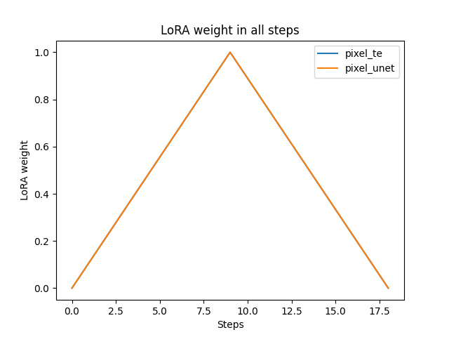
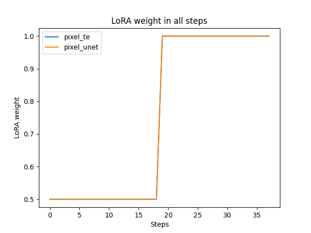
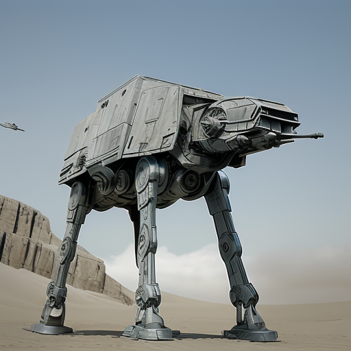
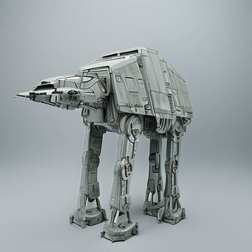
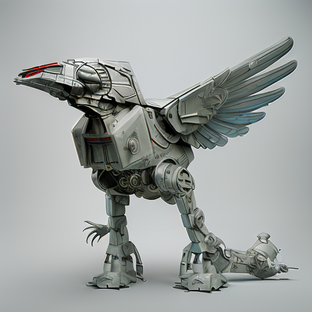
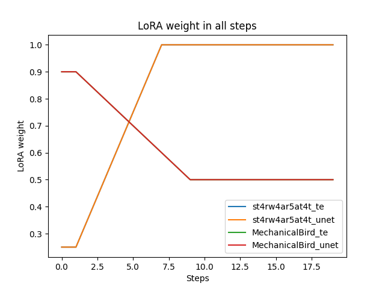
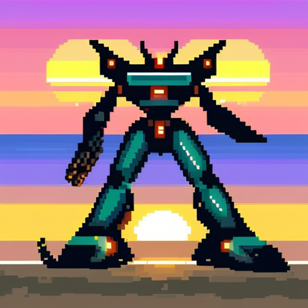
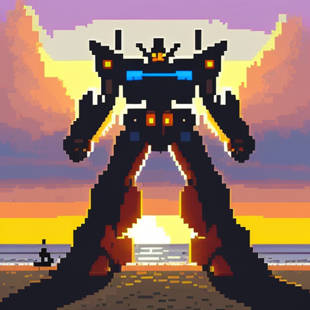
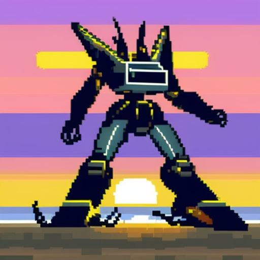

# LoRa Control - Dynamic Weights Controller

This is an extension for the [Automatic1111 Stable Diffusion web interface](https://github.com/AUTOMATIC1111/stable-diffusion-webui) which replaces the standard built-in LoraNetwork with one that understands additional syntax for mutating lora weights over the course of the generation. Both positional arguments and named arguments are honored, and additional control for normal versus high-res passes are provided.

The idea was inspired by the step control in [composable lora](https://github.com/a2569875/stable-diffusion-webui-composable-lora), which unfortunately doesn't work with newer versions of the webui.

Quick features:

* Easily specify keyframe weights for loras at arbitrary points
* Extends the existing lora syntax; no new systems to learn.
* Provides for separate control of lora weights over initial and hires passes.

### Installation

**⚠️ This extension only works with the Automatic1111 1.5RC or later. It is directly tied to the new network handling architecture. It does not currently work with SD.Next, and will not unless SD.Next adopts the 1.5 extra network architecture.**

In the Automatic1111 UI, go to Extensions, then "Install from URL" and enter

```
https://github.com/cheald/sd-webui-loractl
```

Then go to the "Installed" tab and click "Apply and Restart UI". You don't have to enable it; the extension is "always on". If you don't use the extended syntax, then the behavior is identical to the stock behavior.

### Basic Usage

The standard built-in Lora syntax is:

    <lora:network_name[:te_multiplier[:unet_multiplier[:dyn_dim]]]>

or with named parameters:

    <lora:network_name:te=0:unet=1:dyn=256>

This extension extends this syntax so that rather than just single weights, you can provide a list of `weight@step`, delimited by commas or semicolons. The weight will then be interpolated per step appropriately.

The weight may be:

* A single number, which will be used for all steps (e.g, `1.0`)
* A comma-separated list of weight-at-step pairs, e.g. `0@0,1@0.5,0@1` to start at 0, go to 1.0 strength halfway through generation, then scale back down to 0 when we finish generation. This is smoothly interpolated, so the weight curve looks something like:



The step value (after the @) may be a float in the 0.0-1.0 domain, in which case it is interpreted as a percentage of the pass steps. If it is greater than 1, then it is interpreted as an absolute step number.

If only a single argument (or just `te`) is given, then it applies to both the text encoder and the unet.

The default weight for the network at step 0 is the earliest weight given. That is, given a step weight of `0.25@0.5,1@1`, the weights will will begin at 0.25 weight, stay there until until half the steps are run, then interpolate up to 1.0 for the final step.

### Network Aliases

You can also use `loractl` as the network name; this is functionally identical, but may let you dodge compatibility issues with other network handling, and will cause loractl networks to just not do anything when the extension is not enabled.

    <loractl:network:0.5:hr=1.0>

### Separate high-res pass control

You can use the named arguments `hr`, `hrte`, and `hrunet` to specify weights for the whole lora, or just the te/unet during the high res pass. For example, you could apply a lora at half weight during the first pass, and full weight during the HR pass, with:

    <lora:network:0.5:hr=1.0>



Or, you could grow the lora strength during the first pass, and then decline during the HR pass:

    <lora:network:0@0,1@1:hr=1@0,0@1>

### Lora mixing

Sometimes, one lora or another is too powerful. Either it overpowers the base model, or it overpowers other loras in the prompt. For example, I have the [Mechanical Bird](https://civitai.com/models/98218/mechanical-bird) and [Star Wars AT-AT](https://civitai.com/models/97961/star-wars-at-at-1980) loras together in a prompt. I want a sweet birdlike cybernetic AT walker!

So I first try just throwing them together:

```
<lora:st4rw4ar5at4t:1> <lora:MechanicalBird:1> mechanical bird,  st4rw4ar5at4t
```


The AT lora is clearly too powerful, so I'll try mixing them together more conservatively:

```
<lora:st4rw4ar5at4t:0.5> <lora:MechanicalBird:0.5> mechanical bird,  st4rw4ar5at4t
``````



The bird hardly comes through; the AT-AT lora is clearly far more heavily overtrained.

I can try reducing that AT-AT lora weight to let more of the bird come through:

```
<lora:st4rw4ar5at4t:0.55> <lora:MechanicalBird:1> mechanical bird,  st4rw4ar5at4t
```


That AT-AT model is just way too strong, and we can't get enough bird to come through. This is where we can use Loractl!

```
<lora:st4rw4ar5at4t:0@0,1@0.4> <lora:MechanicalBird:1@0,0.5@0.5> mechanical bird,  st4rw4ar5at4t
```

Here, I'm going to set the AT lora's weight to 0 to start, ramping up to full strength by 40%. The mechanical bird will start at full strength, and will ramp down to 50% strength by 50%.



That's more like it!

We can see how the lora weights applied over the course of the run:



### Lora warmup

Sometimes, a lora has useful elements that we want in an image, but it conflicts with the base model. For an example here, I'm using Realistic Vision 4.0 (which is a hyper-realistic model) and a Pixelart lora (which plays well with anime models, but which fights with realistic models).

I want a picture of an awesome mecha at sunset. First we'll get a baseline with the pixelart lora at 0 strength:

```
<lora:pixel:0> pixelart, mecha on the beach, beautiful sunset, epic lighting
```


Sweet! That looks awesome, but let's pixelify it:

```
<lora:pixel:1> pixelart, mecha on the beach, beautiful sunset, epic lighting
```



The clash between the animated and realistic models is evident here: they fight for inital control of the image, and the result ends up looking like something that you'd have played in the 80s on a Tandy 1000.

So, we're going to just stuff the pixelart lora for the first 5 steps, THEN turn it on. This lets the underlying model determine the overall compositional elements of the image before the lora starts exerting its influence.

```
<lora:pixel:1:0@5,1@6> pixelart, mecha on the beach, beautiful sunset, epic lighting
```


Awesome.

### Separate text encoder/unet control

The new 1.5.0RC allows for separate control of the text encoder and unet weights in the lora syntax. loractl allows for variable control of them independently, as well:

```
<lora:pixel:te=1:unet=0@0,1@1> pixelart, mecha on the beach, beautiful sunset, epic lighting
```



```
<lora:pixel:te=0@0,1@1:unet=1> pixelart, mecha on the beach, beautiful sunset, epic lighting
```



You can play with each of the weights individually to achieve the effects and model mixing best desired.

### Running tests

A basic test suite is included to assert that parsing and setup of weight params is correct. Invoke it with:

    python -m unittest discover test

Please note that the extension will need to be properly installed in a webui install to be tested, as it does rely on imports from the webui itself.
